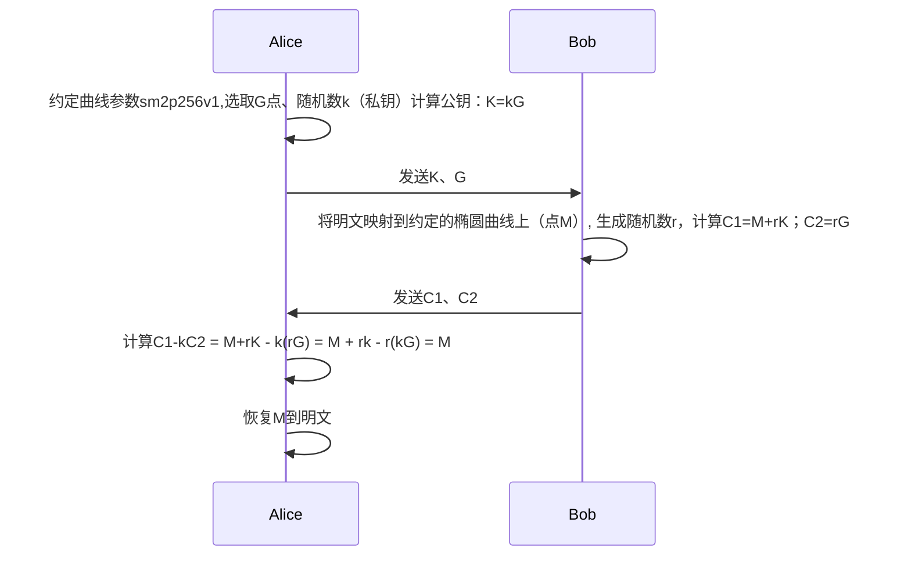
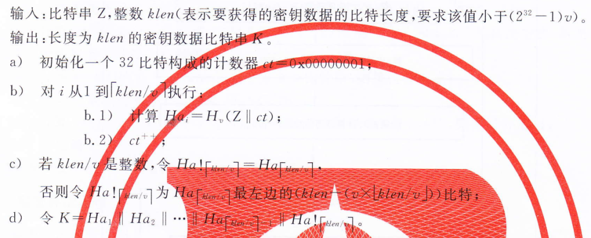
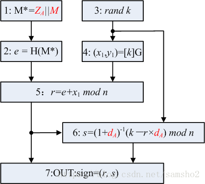
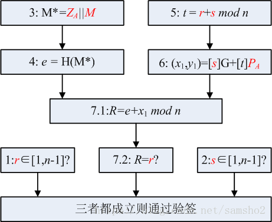

# SM2算法

> 所有信息来源于互联网，如果有侵犯您权利，请联系我删除
>
> SM2属于ECC（椭圆曲线加密算法），它由椭圆曲线方程式*y^2=x^3+ax+b* (mod p)描述，不同的椭圆曲线参数会产生不同的曲线。我国经复杂的数学推理证明定义了一组椭圆曲线参数，并命名为SM2。注意SM2定义的加解密过程和签名过程与ECC由差别，详见《GMT 0003.2-2012 SM2椭圆曲线公钥密码算法第2部分：数字签名算法》、《GMT 0003.4-2012 SM2椭圆曲线公钥密码算法第4部分：公钥加密算法》

## ECC标准加解密过程



## 数学基础

> 定义：曲线上任意两点的连线延长做一条直线，这条直线与曲线有一个交点，根据椭圆曲线的对称性，我们做这个交点的x轴对称，得一个新的点，该点仍在曲线上，这个过程，我们叫打点，即dot。


​	我们来看上图，A dot B得到的是C点。（很多文献把这个过程定义成椭圆曲线的加法），我们持续这一过程反复

```
A dot B=C
A dot C=D
A dot D=E
```


​	重复这一过程，我们来看看结果，我们发现了一些特性，如果图像无限大的话，打点这一过程可以一直持续。也就是说，我们可一直打点，我们假设进行了无数次的打点，并得到其中一点G，如果我们只知道G和A，那么G点是A打点几次得出的？我想这是一个很难的数学问题。

> 结论
>
> 在给定起始点A和终点G的情况下，我们想找出打点次数n的值是很困难的。正推容易，反推很难，这就是ECC算法的单向函数，也是ECC算法的数学基础。

上一节加密过程中G为起点（参数固定公开），k即为打点次数（随机，私钥），K=kG为最终的打点（公钥），由K、G很难推导出k。

## ECC签名过程

### 签名定义
```mathematica
Sig=Fsig(Fhash(m),dA)

- dA是私钥
- m是待签名信息
- Fhash是哈希函数
- Fsig是签名算法
- Sig是签名结果
- Sig = (R,S)
```

### 签名过程
```mathematica
1. 生成随机数k，作为临时私钥
2. 临时公钥P = k*G
3. R是P的x坐标
4. S = k-1(Hash(m) + dA * R) mod p

- k是步骤1中的临时私钥
- R是步骤2中临时公钥的x坐标值
- dA是私钥
- m是带签名数据
- p是椭圆曲线的素数阶
   [公钥生成方法见这篇文章](https://mp.csdn.net/mdeditor/83268791#)
```
### 验证签名过程
```mathematica
验证签名是生成签名的反过程，使用R,S和公钥计算P
 P = S-1 * Hash(m) * G + S-1 * R * Qa

- R和S是签名值
- Qa是签名私钥对应的公钥
- m是源数据
- G是椭圆曲线的预置生成点
   如果最终计算出来P和R是相等的，那么签名通过
```


## SM2 加解密过程

### 加密


在A1步骤中，需要注意不能使用C语言中简单的随机数函数，因为这里 k 是一个很大的数字，有32字节，在GmSSL是用 BIGNUM 结构来表示的。在一般网络库中都会定义这种大整数类型，也会提供了随机函数发生器。

在A2步骤中，一般实现了ECC算法的网络库都实现了 [k]G 这种运算，找到使用即可。将C1转化为比特串，需要考虑CPU大小端的问题，通常网络库有现成的函数。

在A3步骤中，刚开始看文档没明白 h 值是什么，后来才理解到这就是曲线参数的 cofactor，而且这个步骤主要是验证公钥PB的有效性，略过也没问题。

在A5步骤中，有个KDF函数需要实现。KDF函数的流程如下，其中的Hv函数请使用SM3：



A7步骤的Hash也采用SM3

在最后拼接 C1 || C3 || C2 步骤，并不是把这些字节拼接起来就完事，我吃过大亏。因为在解密步骤中，还需要用到 x1、y1、C3、C2这几个参数，如果拼接成一个bit串，接收方如何拆分？如果我们内部使用，当然可以根据它们各自的长度（对于指定SM2曲线和SM3哈希算法，x1, y1, C3的长度是固定的）来拆分，但这样不够灵活，万一换了命名曲线或哈希算法呢？在文档中没有找到说明，但我研究了GmSSL的源码，才弄明白要采用ASN.1 DER编码，这样接受方就可以通过DER解码，分别拿到x1、y1、C3、C2参数值。关于DER编码解码，请参考相关的资料，一般网络库都会提供DER编解码的函数，我们只要调用就可以了。

最后这一步，要是只看这份文档，就会掉进一个大坑。我在本地实现了SM2的加密和解密，使用 《GMT 0003.4-2012》文档附录中的数据进行测试，也都通过，但在与第三方服务器端对接时，总是解密失败，后来才发现是因为这个原因。

### 解密


## SM2 签名解签名过程

### 签名



### 解签名

