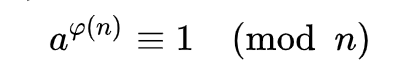
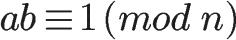

# RSA

> 内容从互联网收集，有问题联系我删除。
>
> 本文归纳理解RSA需要掌握的理论知识。

## 数论基础

### 互质关系

> 如果两个正整数，除了1以外，没有其他公因子，我们就称这两个数是[互质关系](https://zh.wikipedia.org/zh-cn/互素)（coprime）。比如，15和32没有公因子，所以它们是互质关系。这说明，不是质数也可以构成互质关系。

```
1. 任意两个质数构成互质关系，比如13和61。

2. 一个数是质数，另一个数只要不是前者的倍数，两者就构成互质关系，比如3和10。

3. 如果两个数之中，较大的那个数是质数，则两者构成互质关系，比如97和57。

4. 1和任意一个自然数是都是互质关系，比如1和99。

5. p是大于1的整数，则p和p-1构成互质关系，比如57和56。

6. p是大于1的奇数，则p和p-2构成互质关系，比如17和15。
```

### 欧拉函数

> 任意给定正整数n，请问在小于等于n的正整数之中，有多少个与n构成互质关系？（比如，在1到8之中，有多少个数与8构成互质关系？）
>
> 计算这个值的方法就叫做[欧拉函数](https://zh.wikipedia.org/wiki/欧拉函数)，以φ(n)表示。在1到8之中，与8形成互质关系的是1、3、5、7，所以 φ(n) = 4。φ(n) 的计算方法并不复杂，但是为了得到最后那个公式，需要一步步讨论。

#### 通用公式

> 其中 ![[公式]](https://www.zhihu.com/equation?tex=p_1%2Cp_2%2Cp_3%2C%5Ccdots%2Cp_k) 是 ![[公式]](https://www.zhihu.com/equation?tex=n) 的所有不重复的素因子。

![[公式]](https://www.zhihu.com/equation?tex=%5Cbbox%5B%23C0FFFF%2C5px%2Cborder%3A2px+solid+%2390A0FF%5D%7B+%5Cvarphi%28n%29%3Dn%281-%5Cfrac%7B1%7D%7Bp_1%7D%29%281-%5Cfrac%7B1%7D%7Bp_2%7D%29%281-%5Cfrac%7B1%7D%7Bp_3%7D%29%5Ccdots%281-%5Cfrac%7B1%7D%7Bp_k%7D%29+%7D%5C%5C)

#### 特例情况

```matlab
情况1
如果n=1，则 φ(1) = 1 。因为1与任何数（包括自身）都构成互质关系。

情况2
如果n是质数，则 φ(n)=n-1 。因为质数与小于它的每一个数，都构成互质关系。比如5与1、2、3、4都构成互质关系。
```

```matlab
情况3
如果 p 为素数，n 是 p 的正整数次方，那么 φ(n) = φ(p^k) = p^k (1-p^-1) 
```

```
情况4
如果n可以分解成两个互质的整数之积，
　　n = p1 × p2
则
　　 v = φ(p1p2) = φ(p1)φ(p2)
即积的欧拉函数等于各个因子的欧拉函数之积。比如，φ(56)=φ(8×7)=φ(8)×φ(7)=4×6=24。
```

### 欧拉定理

​	如果正整数n和整数a互质，那么就有（φ(n)是欧拉函数）:



### 最大公约数gcd、最小公倍数lcm


### 同余

> 同余定理：给定一个正整数m，如果两个整数a和b满足a-b能够被m整除，即(a-b)/m得到一个整数，那么就称整数a与b对模m同余，记作a≡b(mod m)。对模m同余是整数的一个等价关系。


### 费马小定理


### 模反元

如果两个正整数a和n互质，那么一定可以找到整数b，使得 ab-1 被n整除，或者说ab被n除的余数是1。



这时，b就叫做a的["模反元素"](http://zh.wikipedia.org/wiki/模反元素)。


## RSA的e、d推导过程

```
第一步，随机选择两个不相等的质数p和q。

第二步，计算p和q的乘积n。

第三步，计算n的欧拉函数φ(n)。

第四步，随机选择一个整数e，条件是1< e < φ(n)，且e与φ(n) 互质。

第五步，计算e对于φ(n)的模反元素d。
```

